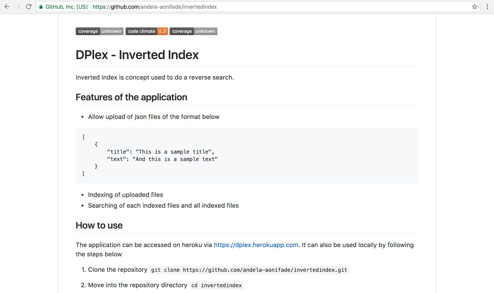
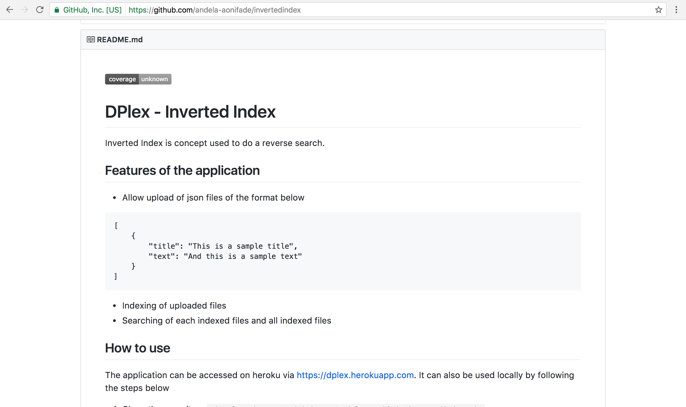

#### Output
- **Using**: `Code Climate` and `Coveralls`
- **Deliver**: a screenshot of your code coverage and GPA badges in your repo's README file
- **With**: *independently*

- **Screenshot**
- Code Climate Badge Screenshot

- Coveralls Badge Screenshot

