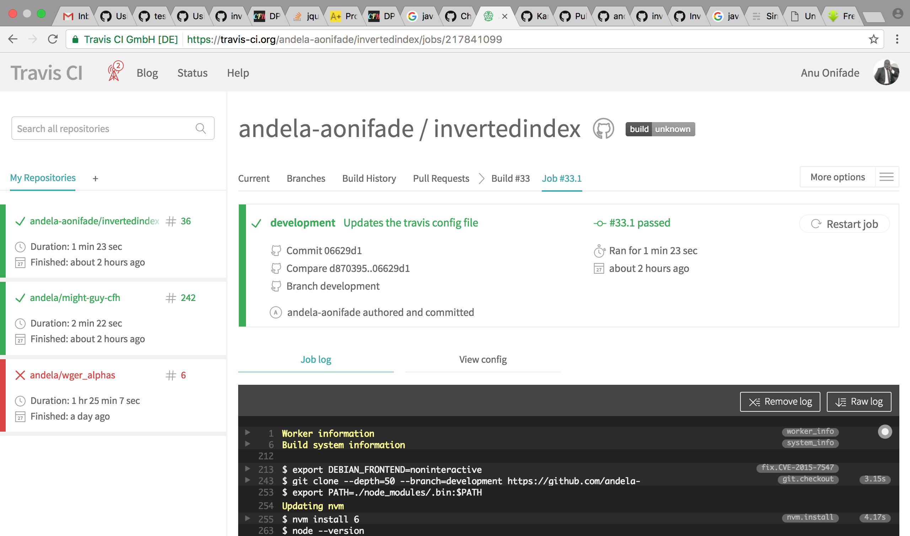
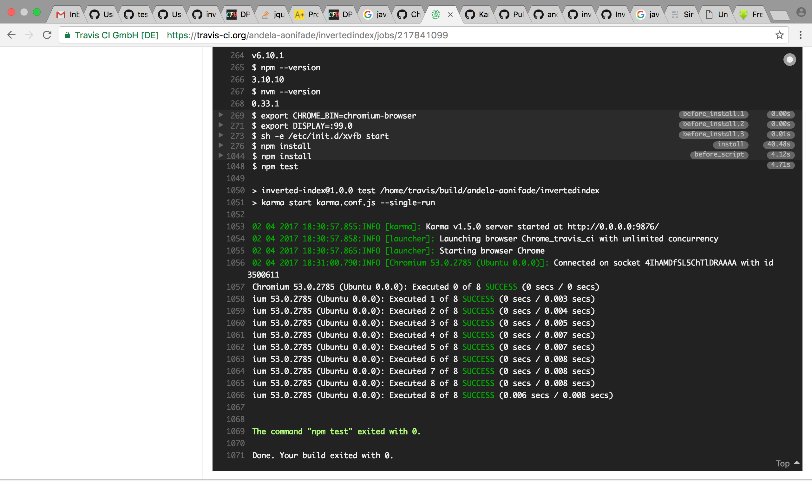

#### Output
- **Using**: TravisCI
- **Deliver**: a link to a successful TravisCI build of your `development` branch (it should include test runs)
- **With**: *independently*

- **Link to successful TravisCI built**

- [Link to Travis built](https://travis-ci.org/andela-aonifade/dplex/builds/219772252)
- Travis CI build Screenshots
- 
- 
