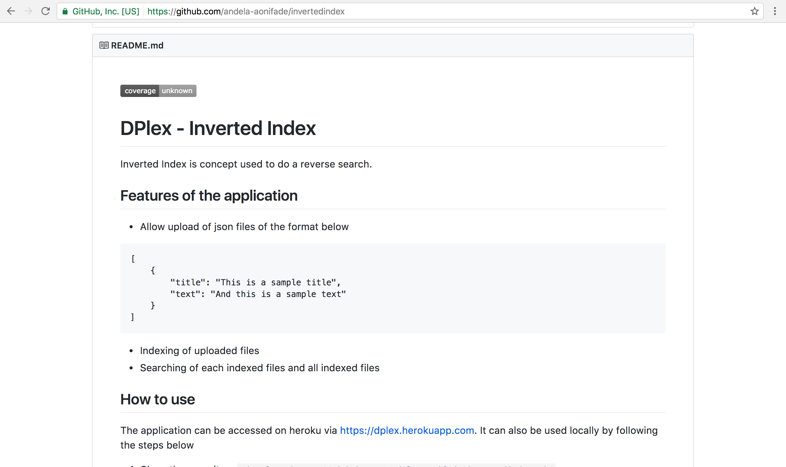

#### Output
- **Using**: Terminal & GitHub
- **Deliver**: two screenshots of ESLint [Airbnb](https://github.com/airbnb/javascript)  style violations in the terminal and [HoundCI](https://houndci.com/) comment on a PR
- **With**: *independently*

- **Screenshots:**
- Code Climate Badge Screenshot

- Coveralls Badge Screenshot

